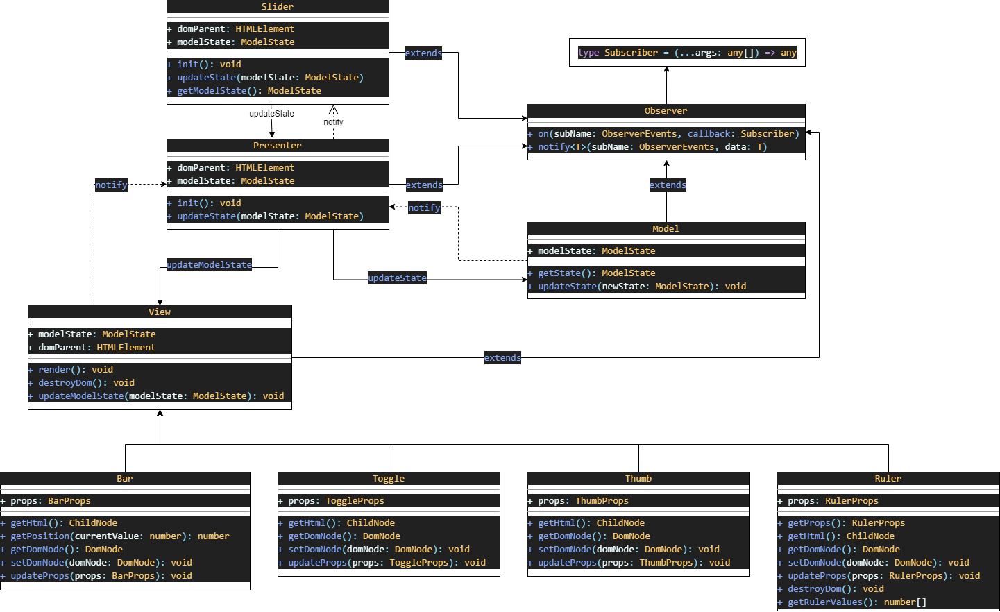

# slider [plugin]

[View Slider](https://nixjke.github.io/slider/)

## Installation

```bash
git clone https://github.com/nixjke/slider.git
cd slider
npm install
npm run build
```

## Commands

Start: `npm start`
Build: `npm run build`
Tests: `npm test`
Tests with coverage: `npm run coverage`
Send dist to gh-pages: `npm run deploy`

## Using

Default slider

```html
<div class="js-default-slider"></div>
```

```javascript
new Slider(document.querySelector('.js-default-slider'))
```

Slider with own settings

```html
<div class="js-range-slider"></div>
```

```javascript
new Slider(document.querySelector('.js-range-slider'), {
  currentValues: { min: 20, max: 80 },
  orientation: 'horizontal',
  range: { min: 0, max: 100 },
  ruler: false,
  step: 1,
  thumb: false,
})
```

Default settings:

```javascript
const defaultState: ModelState = {
  currentValues: { min: 15 },
  range: { min: 0, max: 100 },
  ruler: true,
  thumb: true,
  step: 1,
  orientation: 'horizontal',
}
```

## Architecture


